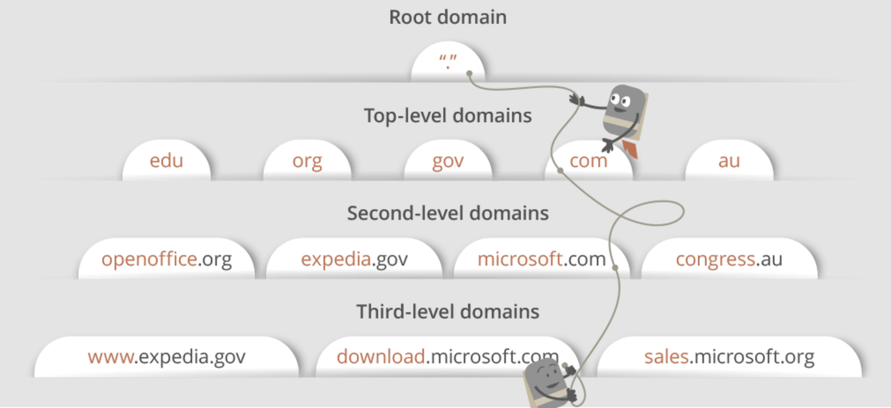
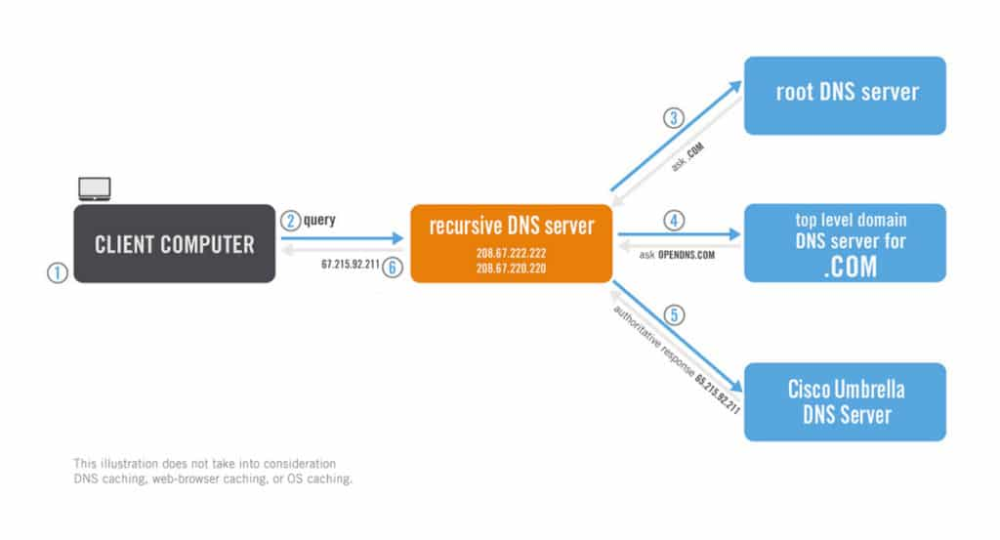
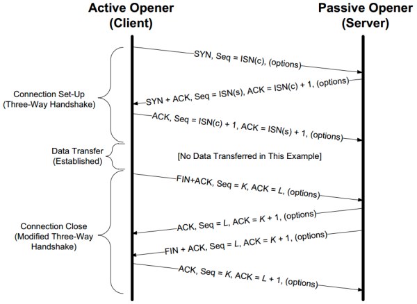
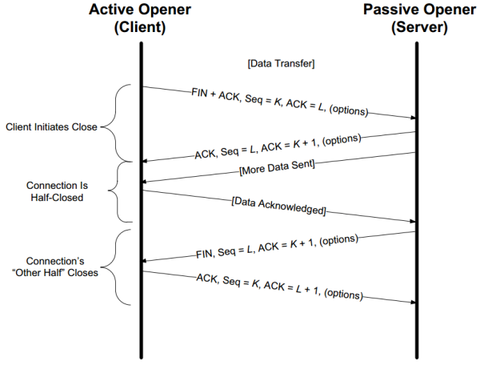

ComputerNetwork
- [FAQ](#faq)
- [IPv4](#ipv4)
- [IPv6](#ipv6)
- [CDN](#cdn)
- [DNS](#dns)
- [TCP three way handshake](#tcp-three-way-handshake)

## FAQ
  * [OSI Model](https://en.wikipedia.org/wiki/OSI_model)
  * [TCP vs UDP](https://stackoverflow.com/questions/5970383/difference-between-tcp-and-udp)
  * DNS
    * Domain Name System
      * Root Domain (.)
      * Top Level Domain (TLD)
        * general TLD (gTLD)
          * .com .net .edu .org
        * country-code TLD (ccTLD)
          * tw, hk, us
      * Secondary Domain
        * microsoft.com, google.com
      * Sub Domain
        * sales.microsoft.com


## IPv4
  * Net_ID, Host_ID, CIDR(netmask)
  * ClassA-E:
  * Public IP, Private IP
  * DHCP
  * Ref:
    * Onenote
    * https://www.jannet.hk/zh-Hant/post/IP-Address-Version-4-IPv4/
    * https://docs.oracle.com/cd/E18752_01/html/816-4554/ipplan-5.html#exlvx


## IPv6
 * Prefix, Subnet ID, Interface ID, CIDR
 * Global Unitcast Address, Link Local Address (fe80::interfaice-ID/10)
 * EUI-64
   * This feature is a key benefit over IPv4 as it eliminates the need of manual configuration or DHCP as in the world of IPv4.
   * The IPv6 EUI-64 format address is obtained through the 48-bit MAC address. .
 * Ref:
   * Onenote
   * https://www.jannet.hk/zh-Hant/post/IP-Address-Version-6-IPv6/
   * https://docs.oracle.com/cd/E18752_01/html/816-4554/ipv6-overview-10.html
   * https://community.cisco.com/t5/networking-documents/understanding-ipv6-eui-64-bit-address/ta-p/3116953

## CDN


## DNS
  * Domain Name System
  * 
    * For maps.google.com, first, the DNS recursor will contact the root name server. The root name server will redirect it to .com domain name server. .com name server will redirect it to google.com name server. google.com name server will find the matching IP address for maps.google.com in its’ DNS records and return it to your DNS recursor which will send it back to your browser.
    * Root Domain
      * .
    * Top Level Domain (TLD)
      * general TLD (gTLD)
        * .com .net .edu .org
      * country-code TLD (ccTLD)
        * tw, hk, us
    * Secondary Domain
      * microsoft.com, google.com
    * Sub Domain
      * sales.microsoft.com
  * DNS Query Flow
    * 
    * Recurisve DNS nameservers （provided by ISP)
    * Authoritative DNS nameservers
    * FLow:
      * Your computer asks the recursive DNS server to locate the IP address of www.google.com. **The recursive DNS nameserver is now assigned the task of finding the IP address of the website**.
      * The recursive DNS server first asks the root domain nameserver for the IP address of the .com TLD server, since www.google.com is within the .com TLD. The root domain nameserver responds with the address of the TLD server.
      * Next, the recursive DNS server asks the TLD authoritative server where it can find the authoritative DNS server for www.google.com. The TLD authoritative server responds, and the process continues.
      * The authoritative server for www.google.com is asked where to find www.google.com and the server responds with the answer. Once the Cisco Umbrella recursive DNS server knows the IP address for the website, it responds to your computer with the appropriate IP address.

  * Resource Record:
    * SOA:
      * Start of authorith
    * PTR Record :
      * Pointer, transfer IP to Domain
      * example:
        ```shell
        $ dig -x 52.38.127.248
        ```
    * NS:
      * Get domain of the service domain
      * example:
        ```shell
        # 1. get the domain of the service domain (from.ers.trendmicro.com )
        $ dig NS from.ers.trendmicro.com

        # 2. get the service IP of the domain
        $ dig A hashsrv.ers.trendmicro.com
        ```
    * MX:
      * Mail exchange
    * A:
      * IPv4 Answer
      * **Maps a name to one or more IP addresses**, when the IP are known and stable.
    * AAAA:
      * IPv6 Answer
    * CNAME:
      * Canonical name
      * Maps a name to another name. It should only be used when there are no other records on that name.
      * One Cname can map to 1 domain (1-to-1).
    * Alias:
      * Maps a name to another name, but in turns it can **coexist** with other records on that name.
      * One Alias can map to Mutliple domain(1-to-many).
    * URL
      * Redirects the name to the target name using the HTTP 301 status cod

  * Ref:
    * https://webhostinggeeks.com/guides/dns/
    * http://dns-learning.twnic.net.tw/bind/intro6.html
    * [What are Top-Level Domain (TLD) Name Servers?](https://dnsmap.io/articles/what-are-top-level-domain-(tld)-name-servers)
    * [What is the difference between authoritative and recursive DNS nameservers?](https://umbrella.cisco.com/blog/what-is-the-difference-between-authoritative-and-recursive-dns-nameservers)

## TCP
  * TCP Header
    * 
    * Sequence number
      * Sequence number of TCP packet
    * Acknowledge number
    * TCP Code (control flags)
      * URG
        * urgent
      * ACK
        * Acknowledge
      * PSH
        * Push function (flush buffer)
      * RST
        * Reset Connection
      * SYN
        * Sync
      * FIN
        * Finish

  * Standard:
    * 
    * Connection Set-up
    * Data Transfer
    * Connection Close

  * TCP half Close
    * 
    * The first two segments are the same as for a regular close: a FIN by the initiator, followed by an ACK of the FIN by the recipient. The operation then differs from Figure 13-1, because the side that receives the half-close can still send data.
  * Ref:
    * https://notfalse.net/7/three-way-handshake
    * https://notes.shichao.io/tcpv1/ch13/
