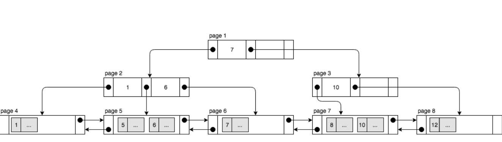
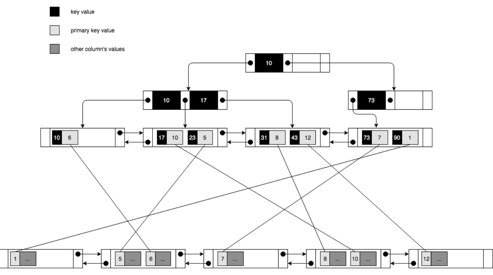

 # MySQL

 Table of Contents
- [MySQL](#mysql)
  - [FAQ](#faq)
  - [Design](#design)
  - [Tuning](#tuning)
  - [Data Types](#data-types)
  - [Charset](#charset)
  - [CAP](#cap)
  - [Security](#security)
  - [Normalization and Denormalization](#normalization-and-denormalization)
  - [Partitions](#partitions)
  - [Sharding](#sharding)
  - [Federation (functional partitioning)](#federation-functional-partitioning)
  - [Stored Objects](#stored-objects)
  - [Indexes](#indexes)
  - [Locking and Transaction Model](#locking-and-transaction-model)
  - [Join](#join)
  - [Example:](#example)


## FAQ
  * Normalized vs. Denormalized Databases
    * **Normalized databases** are designed to minimize **redundancy**
    * While **denomalized databases** are designed to optimized **read time**.
    * For example:
      * In a traditional normzlied database with data like Courses and Teachers, Courses might contain a column called TeachersID, which is a foreign key to Teacher.
        * One Benefit of this is that information about the teacher is **only stored once in the databases**.
        * The drawback is that many common queries will require expensive joins.
    * Ref:
      * https://medium.com/@katedoesdev/normalized-vs-denormalized-databases-210e1d67927d
  * Partition vs Sharding
    * Partitioning is more a generic term for **dividing data across tables or databases**.
    * **Sharding is one specific type of partitioning**, namely horizontal partitioning.
    * Ref:
      * https://www.quora.com/Whats-the-difference-between-sharding-DB-tables-and-partitioning-them
  * How to find slow query
    * before
      * explain
      * ...
    * after
      * Enable slow query log
      * Use SHOW PROCESS LIST
      * ...
  * SQL vs NoSQL
    * SQL
      * Relation data model
        * **Highly-Structured** table organization with rigidly-defined data forrmats and record structure.
      * Reasons for SQL
        * Structured data
        * **Strict schema**
        * Relational data
        * **Transactions** (Mongo 4.0 also supports transaction)
      * Drawbacks:
        * Need for complex joins

    * NoSQL
      * Document data model
        * Collection of complex documents with arbitrary, nested data formats and varying record format.
      * Reasons for NoSQL
        * Semi-structured data
        * **Dynamic or flexible schema**
        * Non-relational data
        * Store many TB (or PB) of data
        * Very data intensive workload
        * **Very high throughput for IOPS** (auto sharding)
      * Drawbacks:
        * No transactions (before mongo4.0)
    * Ref:
      * https://www.infoq.com/articles/Transition-RDBMS-NoSQL/

## Design
  * APP
    * Connection Pool setting
      * Depend on your processes, threads in your app and capability of your mysql server.

## Tuning
  * **Profiling**:
    * mtop: monitoring tool
    * Slow query log
    * EXPLAIN
      * EXPLAIN is used to obtain a query execution plan (that is, an explanation of how MySQL would execute a query).
    * [SHOW PROCESSLIST](https://dev.mysql.com/doc/refman/8.0/en/show-processlist.html)
      * SHOW PROCESSLIST shows which threads are running. If you have the PROCESS privilege, you can see all threads.
      * The SHOW PROCESSLIST statement is very useful if you get the “too many connections” error message and want to find out what is going on.
    * [SHOW STATUS](https://dev.mysql.com/doc/refman/8.0/en/show-status.html)
      * SHOW STATUS provides server status information. This statement does not require any privilege. It requires only the ability to connect to the server.
  * **Benchmark**:
    * Simulate high load situations
      * [ab](http://httpd.apache.org/docs/2.2/programs/ab.html)
      * supersmack
      * SysBench
  * Tighten up **schema**
    * MySQL dumps to disk in contiguous blocks for fast access.
    * CHAR vs VARCHAR
      * **Use CHAR instead of VARCHAR** for **fixed-length** fields.
      * CHAR effectively allows for fast, random access, whereas with VARCHAR, you must find the end of a string before moving onto the next one.
      * VARCHAR(255) is the largest number of characters that can be counted in an 8 bit number, often maximizing the use of a byte in some RDBMS.
    * TEXT
      * Use **TEXT** for large blocks of text such as blog posts.
      * **TEXT also allows for boolean searches**.
      * Using a TEXT field results in storing a pointer on disk that is used to locate the text block.
    * INT
      * TINYINT (1 byte)
      * SMALLINT (2 bytes)
      * MEDIUMINT (3 bytes)
      * INT (4 bytes)
      * BIGINT (8 bytes) = (maximum value unsigned 2^64-1)
      * Use **INT** for larger numbers up to 2^32 or 4 billion.
    * DECIMAL
      * Use **DECIMAL** for **currency** to avoid floating point representation errors.
    * BLOB
      * Avoid storing large BLOBS, store the location of where to get the object instead.
    * Constraints
      * Set the **NOT NULL** constraint where applicable to improve search performance.
      * Declare columns to be NOT NULL if possible. It makes SQL operations faster, by enabling better use of indexes and eliminating overhead for testing whether each value is NULL. You also save some storage space, one bit per column. If you really need NULL values in your tables, use them. Just avoid the default setting that allows NULL values in every column.
  * Use good **indexes**
    * Basic
      * Columns that you are querying (**SELECT, GROUP BY, ORDER BY, JOIN**) could be faster with indices.
      * Indices are usually represented as **self-balancing B-tree** that keeps data sorted and allows searches, sequential access, insertions, and deletions in logarithmic time.
      * Writes could also be slower since the index also needs to be updated.
    * Use **composite indexes**:
      * If certain fields tend to **appear together in queries**, then it’s a good idea to create a composite index on them.
      * Similar to single indexes, the cardinality of the fields matters to the effectiveness composite indexes.
      * if a composite index is made on column1 , column2 , column3 ,…, columnN . Then queries like
        ```sql
        SELECT * FROM table
        WHERE column1 = 'value';

        SELECT * FROM table
        WHERE column1 = 'value1'
        AND column2 = 'value2';

        SELECT * FROM table
        WHERE column1 = 'value1'
        AND column2 = 'value2'
        AND column3 = 'value3'

        ...

        SELECT * FROM table
        WHERE column1 = 'value1'
        AND column2 = 'value2'
        AND column3 = 'value3'
        ...
        AND columnN = 'valueN'

        ```
        will have performance gain.
    * Avoid Unnecessary Indexes
      * Do not use an index for **low-read** but **high-write** tables.
      * Do not use an index if the field has **low cardinality**.
        * Low-cardinality: refers to columns with few unique values.
        * [Why low cardinality indexes negatively impact performance](https://www.ibm.com/developerworks/data/library/techarticle/dm-1309cardinal/index.html])
  * Avoid expensive joins
    * Denormalize where performance demands it.
  * Partition tables
    * Break up a table by putting hot spots in a separate table to help keep it in memory.
  * Tune the query cache
    * The query cache can be useful in an environment where you have tables that do not change very often and for which the server receives many identical queries.
  * Ref:
    * [10 Tips for Optimizing MySQL Queries](https://aiddroid.com/10-tips-optimizing-mysql-queries-dont-suck/)
    * https://dev.mysql.com/doc/refman/8.0/en/optimization.html
## [Data Types](https://dev.mysql.com/doc/refman/8.0/en/data-type-overview.html)
  * [Numeric Type](https://dev.mysql.com/doc/refman/8.0/en/numeric-type-overview.html)
  * [Date and Time Type](https://dev.mysql.com/doc/refman/8.0/en/date-and-time-type-overview.html)
  * [String Type](https://dev.mysql.com/doc/refman/8.0/en/string-type-overview.html)
  * [JSON](https://dev.mysql.com/doc/refman/8.0/en/json.html) (from mysql 5.7)
    * [How to create index on JSON](https://blog.gslin.org/archives/2016/03/09/6406/mysql-5-7-%E7%9A%84-json%E3%80%81virtual-column-%E4%BB%A5%E5%8F%8A-index/)
      * Use [Virtual Column](https://dev.mysql.com/doc/refman/8.0/en/create-table-generated-columns.html)
        * create **virtual column** on the key street
            ```sql
            ALTER TABLE test_features ADD COLUMN street VARCHAR(30) GENERATED ALWAYS AS (json_unquote(json_extract(`feature`,'$.properties.STREET'))) VIRTUAL;
            ```
        * create an index on it- [MySQL](#mysql)
            ```sql
            ALTER TABLE test_features ADD KEY `street` (`street`);
            ```

## Charset
  * [Never use “utf8”. Use “utf8mb4”](https://medium.com/@adamhooper/in-mysql-never-use-utf8-use-utf8mb4-11761243e434)
    * MySQL's **utf8mb4** means **UTF-8**.
    * MySQL's **utf8** means a proprietary character encoding. This encoding can’t encode many Unicode characters.

## CAP
 * Ref:
   * https://speakerdeck.com/shlominoach/mysql-and-the-cap-theorem-relevance-and-misconceptions
* [Atomic] **C**onsistentency:
  * Once a write is successful on a node, any read on any node must reflect that write or any later write
* [High] **A**vailability:
  * Every non-crashed node must respond to requests in a finite amount of time, it is implied that response must be valid, non-error.
* **P**artition Tolerant:
  * The system is able to operate on network partitioning.
    * **Partition tolerance is considered as a given condition**, since network partitioning can and does take place regardless of a system’s design
  * A distributed data store [web service] **cannot provide more than two** out of the three properties. Better illustrated as:
  * If the network is good:
    * You may achieve both **A**vailability and **C**onsisteny (AC)
  * If the network is **P**artitioned
    * You must choose between **A**valibility and **C**onsisteny (AP) or (CP)

## Security
  * [SQL Injection](https://en.wikipedia.org/wiki/SQL_injection)
      * SQL injection is a code injection technique, used to attack data-driven applications, in which malicious SQL statements are inserted into an entry field for execution.
        ```sql
        SELECT * FROM users WHERE name = '' OR '1'='1';
        ```
    * Solution:
      * **Prepare statement**, **Parameter Binding**
        * If you have any "special" characters (such as semicolons or apostrophes) in your data, they will be **automatically quoted** for you by the SQLEngine object, so you don't have to worry about quoting.
          ```python
          import time
          from sqlalchemy import text

          def insert_into_xxx_tbl(user_id, user_name, nickname):
              insert_params_dict = {
                  'user_id': user_id,
                  'user_name': user_name,
                  'nickname': nickname,
                  'db_insert_time': int(time.time()),
                  'db_update_time': int(time.time()),
              }

          ## use sqlalchemy bindparams to prevent sql injection
          pre_sql = 'insert into xxx_tbl (user_id, user_name, nickname, db_insert_time, db_update_time) values(:user_id, :user_name, :nickname, :db_insert_time, :db_update_time)'
          bind_sql = text(pre_sql)
          resproxy = _db_inst.connect().execute(bind_sql, insert_params_dict)

          ## return lastid as event_id
          event_id = resproxy.lastrowid
          ```
       * [Pure ORM](https://stackoverflow.com/questions/6501583/sqlalchemy-sql-injection/6501664)
         *  This also means that unless you deliberately bypass SQLAlchemy's quoting mechanisms, SQL-injection attacks are basically impossible.
         * Correct Example:
           ```python
           session.query(MyClass).filter(MyClass.foo==getArgs['val']))
           ```
         * Bad Example:
            ```python
            session.query(MyClass).filter("foo={}".format(getArgs['val']))
            ```

## Normalization and Denormalization
  * Normalization
    * Ref:
      * https://medium.com/@habibul.hasan.hira/database-normalization-8cdaddbb7715
    * Definition:
      * It is a database **design technique** which organizes tables in a manner that **reduces redundancy and dependency** of data.
      *  It divides larger tables to smaller tables and links them using relationships.
    * **1NF**
      * Every column of a table should be atomic. That means you **can not put multiple values in a database column**.
    * **2NF**
      * If we have **composite primary key! every non key field should be fully **depended on both key**. 
    * **3NF**
      * When a database table is in second normal form, there should be no transitive functional dependency. That means **any non primary key field should not be depend on other** on primary key field.
    * **BCNF**
    * **4NF**
    * **5NF**
  * Denormalization
    * Definition:
      * A database optimization technique in which we **add redundant data to one or more tables**, this can help us avoid costly joins in a relational database.
    * Pros
      * **Retrieving data is faster since we do fewer joins.**
      * Queries to retireve can be simpler, since we need to look at fewer tables.
    * Cons
      * Updates and Inserts are more expensive.
      * Making Update and Insert Code harder to write.
      * **Data may be inconsistent.**
      * **Data redundancy necessitates more storage.**

## [Partitions](https://dev.mysql.com/doc/refman/8.0/en/partitioning.html)
  * FAQ
    * [Partitions and UPDATE](https://stackoverflow.com/questions/12929624/partitions-and-update)
      * **If you UPDATE a row, will the row be moved to another partition automatically**, if the partition conditions of another partition is met?
      * It must move them on update. If it didn't it wouldn't work well. MySQL would have to basically scan all partitions on every query as it couldn't know where records where stored.
    * [How to drop subpartition](https://dev.mysql.com/doc/refman/5.7/en/partitioning-subpartitions.html)
    * [What is the difference between mysql drop partition and truncate partition](https://stackoverflow.com/questions/56244720/what-is-the-difference-between-mysql-drop-partition-and-truncate-partition)
      * DROP PARTITION:
        * also removes the partition from the list of partitions.
      * TRUNCATE PARTITION:
        * leaves the partition in place, but empty.

  * [Partition](http://blog.kenyang.net/2017/06/11/whats-mysql-partition)
    * Purpose:
      * **Partition Pruning**
        * Make your queries faster (select, insert, update, delete).
      * **Purge Data**
        * Drop partition is much faster.
          * **Only Range based and List based partition support drop.**
        * Truncate partition:
          * TRUNCATE PARTITION merely deletes rows; it does not alter the definition of the table itself, or of any of its partitions.
      * Note:
        * App does not aware of the partitions.
    * Type
      * Key (column)
        * Mysql would use **built-in hash function** to determine which partition the record will be stored.
        * example:
          ```sql
          CREATE TABLE t (
    	            id INT,
    	            create_time DATETIME
          )
          PARTITION BY KEY(create_time)
          PARTITIONS 10;
          ```
        * Note
          * Deleted by partition does not work
      * **Hash** (INT expression)
        * example:
          ```sql
          CREATE TABLE t (
                  id INT,
                  create_time DATETIME
          )
          PARTITION BY HASH(MONTH(create_time))
          PARTITIONS 12;
          ```
        * Note
          * Deleted by partition does not work
      * **List** (INT expression)
        * example:
          ```sql
          CREATE TABLE t (
                  id INT,
                  create_time DATETIME
          )
          PARTITION BY LIST(DAYOFWEEK(create_time)) (
            PARTITION pMon VALUES IN (1),
            PARTITION pTue VALUES IN (2),
            PARTITION pWed VALUES IN (3),
            PARTITION pThu VALUES IN (4)
          );
          ```
      * **Range** (INT expression)
        * example:
          ```sql
          CREATE TABLE t (
                  id INT,
                  create_time DATETIME
          )
          PARTITION BY RANGE(YEAR(create_time)) (
            PARTITION p2017 VALUES LESS THAN (2018),
            PARTITION p2018 VALUES LESS THAN (2019),
            PARTITION p2019 VALUES LESS THAN (2020)
          );
          ```

  * [Subpartition](https://dev.mysql.com/doc/refman/5.7/en/partitioning-subpartitions.html)

  * Restrictions and Limitations on Partitioning
  * every unique key on the table must use every column in the table's partitioning expression
      * All columns used in the partitioning expression for a partitioned table must be part of every unique key that the table may have.
      * In other words, **every unique key on the table must use every column in the table's partitioning expression. (This also includes the table's primary key**, since it is by definition a unique key. 
    * Ref:
      * https://dev.mysql.com/doc/refman/8.0/en/partitioning-limitations.html

## [Sharding](https://medium.com/system-design-blog/database-sharding-69f3f4bd96db)
  * FAQ:
    * [Differences Between the NDB and InnoDB Storage Engines](https://dev.mysql.com/doc/refman/5.7/en/mysql-cluster-ndb-innodb-engines.html)
  * Approach1: calculate shard key in the app layers
    * [consistent hash](https://medium.com/@sent0hil/consistent-hashing-a-guide-go-implementation-fe3421ac3e8f#.d67hxnv1l)
    * [jump consisten hash](https://blog.gslin.org/archives/2016/07/26/6688/google-%E6%8F%90%E5%87%BA%E7%9A%84-jump-consistent-hash/)
  * Approach2: use [mysql cluster](https://dev.mysql.com/doc/refman/8.0/en/mysql-cluster-overview.html)
    * 
  * Sharding Architecture:
    * Hash Based
    * Range Based
    * Directory Based
  * Advantages:
    * Faster queries response.
    * More write bandwidth
    * Scaling out
  * Drawbacks:
    * Adds complexity in the system.
    * Rebalancing data.
    * Joining data from multiple shards is more complex.

## Federation (functional partitioning)
  * Federation (or functional partitioning) splits up databases by function. For example, instead of a single, monolithic database
  * Drawbacks:
    * Federation is not effective if your schema requires huge functions or tables.
    * You'll need to update your application logic to determine which database to read and write.
    * Joining data from two databases is more complex with a server link.

## [Stored Objects](https://dev.mysql.com/doc/refman/8.0/en/stored-objects.html)
  * Stored procedure
    * An object created with CREATE FUNCTION and used much **like a built-in function**. You invoke it in an expression and it returns a value during expression evaluation.
  * Trigger
    * An object created with CREATE TRIGGER that is associated with a table. **A trigger is activated when a particular event occurs for the table**, such as an insert or update.
  * Event
    * An object created with CREATE EVENT and invoked by the server according to **schedule**.
  * View
    * An object created with CREATE VIEW that when referenced produces a result set. A view acts as a virtual table.

## Indexes
  * Clustered Indexes vs Secondary Indexes (InnoDB)
    * Clustered Indexes
      * Every InnoDB table has a special index called the clustered index where the data for the rows is stored. **Typically, the clustered index is synonymous with the primary key**.
        * When you define a PRIMARY KEY on your table, InnoDB uses it as the clustered index.
        * If you do not define a PRIMARY KEY for your table, MySQL locates the first UNIQUE index where all the key columns are NOT NULL andInnoDB uses it as the clustered index.
        * If the table has no PRIMARY KEY or suitable UNIQUE index, InnoDB internally generates a hidden clustered index named GEN_CLUST_INDEX on a synthetic column containing row ID values.
      * Data Structure
        * **B-Tree**
            * Every node is a page which is the minimum unit InnoDB stores records.
            * Non-Leaf Nodes
               *  **The val of Clustered Keys** and **Pointers to the Child Nodes**
            * Leaf Nodes
               *  **Records** and **Pointers to other leaf nodes**
            * 
      * Data Coverage:
        * All, since list of leaf nodes is the table.
      * Condition Coverage:
        * Depended on the clustered key, please refer [rule of composite indexes](https://medium.com/@User3141592/single-vs-composite-indexes-in-relational-databases-58d0eb045cbe) (The condition order is important)
    * Secondary Indexes
      * In InnoDB, each record in a secondary index contains the **primary key columns** for the row, as well as the **columns specified for the secondary index**. InnoDB uses this primary key value to search for the row in the clustered index.
      * Data Structure
        * B-Tree
          * Every node is a page which is the minimum unit InnoDB stores records.
          * Non-Leaf Nodes
             *  **Values of Secondary Keys** and **Pointers to the Child Nodes**
          * Leaf Nodes
             *  **Values of Secondary Keys** , **Values Clustered Keys** and and **Pointers to the Leaf Nodes**
             *  Clustered Kye points to the table (records)
          * 
            * **The data structure in the bottom are the table (records).**
            * *  **If the primary key is long, the secondary indexes use more space**.
            * **Need another lookup to get raw data in the clustered index if the secondary key and clustered key can not cover the wanted columns**, that is, explain will show "Using Index Condition".
            * [Using Index vs Using Index Condition](https://stackoverflow.com/questions/1687548/mysql-explain-using-index-vs-using-index-condition)
      * Data Coverage:
        * Fields in **secondary key and clustered key** (permutation)
      * Condition Coverage:
        * Depended on the secondary key, please refer [rule of composite indexes](https://medium.com/@User3141592/single-vs-composite-indexes-in-relational-databases-58d0eb045cbe) (The condition order is important)
  * Ref:
    * https://medium.com/@User3141592/single-vs-composite-indexes-in-relational-databases-58d0eb045cbe
    * https://medium.com/@genchilu/a-brief-introduction-to-cluster-index-and-secondary-index-in-innodb-9b8874d4da6a


## Locking and Transaction Model
  * ACID:
    * ACID is a set of properties of relational database transactions.
    * **A**tomicity
      * **Transactions** are atomic units of work that can be committed or rolled back.
      * When a transaction makes multiple changes to the database, **either all the changes succeed when the transaction is committed, or all the changes are undone when the transaction is rolled back**.
    * **C**onsistency
      * The database remains in a **consistent state** at all times.
      * If related data is being updated across multiple tables, **queries see either all old values or all new values, not a mix of old and new values**.
    * **I**solation
      * Transactions are protected (isolated) from each other while they are in progress; **they cannot interfere with each other or see each other's uncommitted data**.
      * In InnoDB, The default isolation level of mysql is "Repeatable Read".
      * In fact, isolation level of "read uncommitted" is not islolated from other transaction.
    * **D**urability
      * The results of transactions are durable: once a commit operation succeeds, the changes made by that transaction are safe from power failures, system crashes, race conditions, or other potential dangers that many non-database applications are vulnerable to.
    * Ref:
      * https://dev.mysql.com/doc/refman/8.0/en/mysql-acid.html

  * Concurrency Control Policies
    * Introduction:
      * In Concurrency Control theory, there are two ways you can deal with conflicts:
        * **You can avoid them**, by employing a pessimistic locking mechanism
          * e.g. Read/Write locks, Two-Phase Locking
        * **You can allow conflicts to occur**, but you need to detect them using an optimistic locking mechanism
          * e.g. logical clock, MVCC
    * **2PL** (2 Phase Locking)
      * Locks alone are not sufficient for preventing conflicts. A concurrency control strategy must define how locks are being acquired and released because this also has an impact on transaction interleaving.
      * For this purpose, the 2PL protocol defines a lock management strategy for ensuring strict serializability.
        * **expanding** phase (locks are acquired, and no lock is allowed to be released)
        * **shrinking** phase (all locks are released, and no other lock can be further acquired).
      * Initially, all database systems employed 2PL for implementing Serializable transactions, but, with time, many vendors have moved towards MVCC (Multi-Version Concurrency Control) concurrency control mechanisms.
    * **MVCC** (multi version concurrency control)
      * When using 2PL, every read requires a shared lock acquisition, while a write operation requires taking an exclusive lock.
        * a shared lock blocks Writers, but it allows other Readers to acquire the same shared lock
        * an exclusive lock blocks both Readers and Writers concurring for the same lock
      * Goal
        * **locking incurs contention, and contention affects scalability**.
        * For this reason, database researchers have come up with a different Concurrency Control model which tries to reduce locking to a bare minimum so that:
          * **Readers don’t block Writers**
          * **Writers don’t block Readers** (but still block Writers)
          * (The readers means non-blocking reads)
    * Ref:
      * https://vladmihalcea.com/2pl-two-phase-locking/
      * https://vladmihalcea.com/how-does-mvcc-multi-version-concurrency-control-work/

  * Phenomenon caused by concurrent transactions
    * Dirty Read
      * Dirty read is **the situation when a transaction reads a data that has not yet been commited.**
    * **Non Repetable Read** (different val in the same field)
      * **Non Repeatable read occurs when a transaction reads same row twice, and get a different value each time.**
      * For example, suppose transaction T1 reads a data. Due to concurrency, another transaction T2 updates the same data and commit, Now if transaction T1 rereads the same data, it will retrieve a different value.
    * Phantom Read (get different data sets)
      * **Phantom Read occurs when two same queries are executed, but the rows retrieved by the two are different.**
      * For example, suppose transaction T1 retrieves a set of rows that satisfy some search criteria. Now, Transaction T2 generates some new rows that matches the search criteria for transaction T1. If transaction T1 re-executes the statement that reads the rows, it gets a different set of rows this time
    * **Lost Update**
      * If two transactions read a value and update the same value, then the first update is lost.
      * example:
        * quantity os A is 4
        * T1:
          ```sql
          SELECT qnantity FROM inventory Where item = A
          ```
        * T2:
          ```sql
          SELECT qnantity FROM inventory Where item = A
          ```
        * T1:
          ```sql
          UPDATE inventory SET qnantity=quantity - 2 Where item = A
          ```
        * T2:
          ```sql
          UPDATE inventory SET qnantity=quantity - 2 Where item = A
          ```
        * And we got error qnantity 2 (should be 0)
      * Solutions:
        * Atomic Operation:
          * DB supports atomic updates
          * atomic check and set
            ```sql
            update user set balance = balance - $amount where user_id = $user_id and balance >= $amount
            ```
        * Locking the object
          * Application can explicitly **lock the row by using ‘for update’** statement in sql.
          * lock the counter_field (exclusive lock)
            ```sql
            SELECT counter_field FROM child_codes FOR UPDATE;
            UPDATE child_codes SET counter_field = counter_field + 1;
            ```
          * see locking read
            * https://dev.mysql.com/doc/refman/8.0/en/innodb-locking-reads.html
        * Change Isolation Level (Serialisable)
        * Automatic detection
          * Oracle, Postgresql, sql server etc have automatic lost update detection in the repeatable read isolation level and automatically abort the second transaction.
          * Mysql does not support ?
        * Compare and set operation
          * Some dbs don’t support transaction but support a compare and set operation to prevent lost updates. But if it reads from old snapshot, it might not prevent lost updates.
    * Write Skew
    * Ref:
      * https://medium.com/@thisisananth/acid-transactions-69b9af755e4c

  * Isolation Level:
    * General Guideline:
      * READ COMMITTED or even READ UNCOMMITTED
        * you can relax the consistency rules with READ COMMITTED or even READ UNCOMMITTED, in situations such as bulk reporting where precise consistency and repeatable results are less important than minimizing the amount of overhead for locking.
  	  * REPEATABLE READ (default isolation)
  		  * InnoDB supports each of the transaction isolation levels described here using different locking strategies. You can enforce a high degree of consistency with the default REPEATABLE READ level, for operations on crucial data where ACID compliance is important.
      * SERIALIZABLE 
        * SERIALIZABLE enforces even stricter rules than REPEATABLE READ, and is used mainly in specialized situations, such as with XA transactions and for troubleshooting issues with concurrency and deadlocks.
    * Read Uncommitted (dirty read)
      * **One transaction may read not yet commited changes made by other transaction**, thereby allowing dirty reads.
    * **Read Committed** (MVCC)
      * This isolation level **guarantees that any data read is committed at the moment it is read (but do not guarantee Repeatable read).**
      * For **nonlocking read**
        * Even within the same transaction, sets and reads its own fresh snapshot.
        * The snapshot is reset to the time of each consistent read operation.
      * For **locking reads** (SELECT with FOR UPDATE or FOR SHARE), UPDATE statements, and DELETE statements
        * InnoDB locks only index records, not the gaps before them, and thus permits the free insertion of new records next to locked records.
        * Gap locking is only used for foreign-key constraint checking and duplicate-key checking.
        * Using READ COMMITTED has additional effects
          * For UPDATE or DELETE statements
            * InnoDB holds locks only for rows that it updates or deletes. **Record locks for nonmatching rows are released after MySQL has evaluated the WHERE condition.** This greatly reduces the probability of deadlocks, but they can still happen.
      	  * For UPDATE statements
        	  * if a row is **already locked**, **InnoDB performs a "semi-consistent" read returning the latest committed version to MySQL so that MySQL can determine whether the row matches the WHERE condition of the UPDATE.**
          	  * If the row matches (must be updated), MySQL reads the row again and this time InnoDB either locks it or waits for a lock on it.
    * **Repeatable Read** (MVCC)
      * This is the default isolation level for InnoDB. 
      * For **nonlocking reads**
        * This means that if you issue several plain (nonlocking) SELECT statements within the same transaction,these SELECT statements are consistent also with respect to each other.
        * **Consistent reads within the same transaction read the snapshot established by the first read.**
          * The snapshot is based on the time when the first read operation is performed.
      * For **locking reads** (SELECT with FOR UPDATE or FOR SHARE), UPDATE, and DELETE statements
        * locking depends on whether the statement uses a unique index with a unique search condition, or a range-type search condition.
          * For a unique index with a unique search condition
            * InnoDB locks only the index record found, not the gap before it.
          * For other search conditions
            * InnoDB locks the index range scanned, using gap locks or next-key locks to block insertions by other sessions into the gaps covered by the range.
    * Serialisable
      * **A serialisable execution is guaranteed to be serialisable.** Serialisable execution is defined to be an execution of operations in which concurrently executing transactions appears to be serially executing.
      * This level is like REPEATABLE READ, but InnoDB implicitly converts all plain SELECT statements to SELECT ... **FOR SHARE if** autocommit is disabled.
    * Ref:
      * https://dev.mysql.com/doc/refman/8.0/en/innodb-transaction-isolation-levels.html

  * Lock Types:
    * **Shared** Locks (S)
      * A kind of lock that **allows other transactions to read the locked object, and to also acquire other shared locks on it, but not to write to it**.
      * example:
        * If transaction T1 holds a shared (S) lock on row r, then requests from some distinct transaction T2 for a lock on row r are handled as follows:
          * A request by T2 for an **S lock can be granted immediately**. As a result, both T1 and T2 hold an S lock on r.
          * A request by T2 for an **X lock cannot be granted immediately**.
    * **Exclusive** Locks (X)
      * A kind of lock that **prevents any other transaction from locking the same row**.
      * example:
        * If a transaction T1 holds an exclusive (X) lock on row r, a request **from some distinct transaction T2 for a lock of either type on r cannot be granted immediately**. Instead, transaction T2 has to wait for transaction T1 to release its lock on row r.
      * Ref:
        * https://dev.mysql.com/doc/refman/8.0/en/glossary.html#glos_exclusive_lock
    * Intention Locks (IS, IX)
      * A kind of lock that applies to the table, used to indicate the kind of lock the transaction intends to acquire on rows in the table. 
      * Intention locks do not block anything except full table requests (for example, LOCK TABLES ... WRITE).
      * **The main purpose of intention locks is to show that someone is locking a row, or going to lock a row in the table**.
      * 2 types of intention lock
        * **IS**
          * An intention shared lock (IS) indicates that a transaction intends to set a shared lock on individual rows in a table.
            ```sql
            SELECT ... FOR SHARE sets an IS lock
            ```
        * **IX**
          * An intention exclusive lock (IX) indicates that a transaction intends to set an exclusive lock on individual rows in a table.
            ```sql
            SELECT ... FOR UPDATE sets an IX lock
            ```
    * **Record** Locks
      * A record lock is a lock on an index record. 
      * example:
        * Prevents any other transaction from **inserting, updating, or deleting** rows where the value of t.c1 is 10.
        ```sql
        SELECT c1 FROM t WHERE c1 = 10 FOR UPDATE;
        ```
    * Gap Lock
      * A gap lock is a lock on a gap between index records, or a lock on the gap before the first or after the last index record. 
      * Gap locks in InnoDB are “purely inhibitive”, which means that their only purpose is to prevent other transactions from inserting to the gap
    * Next-Key Locks
      * A next-key lock is a combination of a record lock on the index record and a gap lock on the gap before the index record.
    * Insert Intention Locks
      * A type of gap lock that is set by INSERT operations prior to row insertion.
      * This type of lock signals the intent to insert in such a way that multiple transactions inserting into the same index gap need not wait for each other if they are not inserting at the same position within the gap. 
    * AUTO-INC Locks
      * An AUTO-INC lock is a special table-level lock taken by transactions inserting into tables **with AUTO_INCREMENT** columns.
      * In the simplest case, if one transaction is inserting values into the table, any other transactions must wait to do their own inserts into that table, so that rows inserted by the first transaction receive consecutive primary key values.
    * Ref:
      * https://dev.mysql.com/doc/refman/8.0/en/innodb-locking.html

  * Read Policies
    * **Locking** Reads
      * If you query data and then insert or update related data within the same transaction, the regular SELECT statement does not give enough protection. **Other transactions can update or delete the same rows you just queried**.
      * InnoDB supports two types of locking reads that offer extra safety.
        * SELECT ... FOR **SHARE**
          * Sets a **shared mode lock** on any rows that are read. Other sessions can read the rows, but cannot modify them until your transaction commits. 
          * Use cases:
            * Suppose that you want to insert a new row into a table child, and make sure that the child row has a parent row in table parent.
            * Prevent other transaction delete the parent record.
              ```sql
              SELECT * FROM parent WHERE NAME = 'Jones' FOR SHARE;
              ```
        * SELECT ... FOR **UPDATE**
          * For index records the search encounters, locks the rows and any associated index entries, the same as if you issued an UPDATE statement for those rows. Other transactions are blocked from updating those rows, from doing SELECT ... FOR SHARE, or from reading the data in certain transaction isolation levels.
          * Use cases:
            * An integer counter
              ```sql
              SELECT counter_field FROM child_codes FOR UPDATE;
              UPDATE child_codes SET counter_field = counter_field + 1;
              ``` 
            * Use LAST_INSERT_ID
              * The currently executing statement does not affect the value of LAST_INSERT_ID(). 
              ```sql
              UPDATE child_codes SET counter_field = LAST_INSERT_ID(counter_field + 1);
              SELECT LAST_INSERT_ID();
              ```
      * Locking Read Concurrency with NOWAIT and SKIP LOCKED
        * NOWAIT
          * A locking read that uses NOWAIT never waits to acquire a row lock. The query executes immediately, **failing with an error if a requested row is locked.**
        * SKIP LOCKED
          * A locking read that uses SKIP LOCKED never waits to acquire a row lock. The query executes immediately, **removing locked rows from the result set.**
          * skip the locked rows.
      * Ref:
        * https://dev.mysql.com/doc/refman/8.0/en/innodb-locking-reads.html
    * **Consistent Nonlocking** Reads
      * Whit is Nonlocking ?
        * **Readers don’t block Writers**
        * **Writers don’t block Readers** (but still block Writers)
      * **A read operation that uses snapshot information to present query results based on a point in time, regardless of changes performed by other transactions running at the same time.** If queried data has been changed by another transaction, the original data is reconstructed based on the contents of the undo log. This technique avoids some of the locking issues that can reduce concurrency by forcing transactions to wait for other transactions to finish.
      * With **REPEATABLE READ** isolation level
        * The snapshot is based on the time when the first read operation is performed.
      * With **READ COMMITTED** isolation level
        * The snapshot is reset to the time of each consistent read operation.
      * Consistent read is the default mode in which InnoDB processes SELECT statements in READ COMMITTED and REPEATABLE READ isolation levels. Because **a consistent read does not set any locks on the tables it accesses**, other sessions are free to modify those tables while a consistent read is being performed on the table.
      * Ref:
        * https://dev.mysql.com/doc/refman/8.0/en/glossary.html#glos_consistent_read
        * https://dev.mysql.com/doc/refman/8.0/en/innodb-consistent-read.html
    * Ref:
      * https://dev.mysql.com/doc/refman/8.0/en/innodb-locking-transaction-model.html
      * [How does a database server handle thousands of concurrent requests](https://medium.com/how-the-web-works/how-does-a-database-server-handle-thousands-of-concurrent-requests-d54352310183)
      * [TritonHo](https://github.com/TritonHo/slides/tree/master/Taipei%202015-01%20talk)


## Join
  * Ref
    * https://katiekodes.com/sql-every-join/
  * Cross Join
    * CROSS JOIN returns the **Cartesian product of rows** from tables in the join. In other words, it will produce rows which combine each row from the first table with each row from the second table

  * (Inner) Join
    * The result set would contain **only the data where the criteria match**.

  * Left (outer) Join
    * The result set will **contain all records from the left table**.
    * If **no matching recrods were found in the right table**, then **its fields will contain the NULL vales**.

  * Right (outer) Join
    * The opposite of Left JOIN.
    * A LEFT JOIN B is equivalent to B RIGHT JOIN A

  * FULL (outer)
    * The type of join **combines the results of LEFT and RIGHT JOINS**.
    * All records from both tables will be included in the result set. If no matching record was found, then the corresponding result fields will have a NULL value.

  * Self Join
  * Left Anti Join
  * Right Anti Join

## Example:
  * atomic check and set
    ```sql
    update user set balance = balance - $amount where user_id = $user_id and balance >= $amount
    ```
  * Lock and update
    * set exclusive lock on counter_field
      ```sql
      SELECT counter_field FROM child_codes FOR UPDATE;
      UPDATE child_codes SET counter_field = counter_field + 1;
      ```
    * or use
      ```sql
      UPDATE child_codes SET counter_field = LAST_INSERT_ID(counter_field + 1);
      SELECT LAST_INSERT_ID();
      ```
  * Q1:
    * Giving the following tables:
      * Courses:
        * CourseID*
        * CourseName
        * TeacherID

      * Teachers:
        * TeacherID*
        * TeacherName

      * Students:
        * StudentID*
        * StudentName

      * StudentCourses:
        * CourseID
        * StudentID
    * Implement a query to get a list of all students and how many course each student is enrolled in.
      * **We can only select values that are in aggregate function or in the GROUP BY clause.**
      * Approach1: group by multiple keys
        ```sql
        SELECT StudentID, StudentName, count(StudentCourses.CourseID) as [Cnt]
        FROM (Students LEFT JOIN StudentCourses ON Students.StudentID = StudentCourses.StudentID)
        GROUP BY Students.StudentID, Students.StudentName;
        ```
      * Approach2: Use 2 aggregated functions
        ```sql
        SELECT StudentID, max(Students.StudentName), count(StudentCourses.CourseID) as [Cnt]
        FROM (Students LEFT JOIN StudentCourses ON Students.StudentID = StudentCourses.StudentID)
        GROUP BY Students.StudentID;
        ```
    * Implement a query to get a list of all teachers and how many students thery each teach.
      * Get a list of TeacherID and how many students are associated with each TeacherID
        * count(StudentCourses.CourseID) is the student cnt for each teacher
          * Allow duplicated students (If a teacher teaches the same student in two courses, the count will be double) .
        ```sql
        SELECT TeacherID, count(Courses.CourseID) as [Number]
        FROM (Courses INNER JOIN StudentCourses on Courses.CourseID = StudentCourses.CourseID)
        GROUP BY Courses.TeacherID;
        ```
      * select the teachers who aren't teaching class
        ```sql
        SELECT TeacherName, isnull(StudentSize.Number, 0)
        FROM Teachers LEFT JOIN
          (SELECT TeacherID, count(Courses.CourseID) as [Number]
           FROM (Courses INNER JOIN StudentCourses on Courses.CourseID == StudentCourses.CourseID)
           GROUP BY Courses.TeacherID) StudentSize
        on Teachers.TeacherID = StudentSize.TeacherID
        ORDER BY StudentSize.Number DSEC;
        ```
  * Q2:
    * Giving the following tables:
      * Employee
        * Id*
        * Salary
    * Get the second highest salary
    * Ref:
      * https://stackoverflow.com/questions/32100/what-is-the-simplest-sql-query-to-find-the-second-largest-value
      * https://leetcode.com/problems/second-highest-salary/solution/
    * Approach1: two max functions
        ```sql
        SELECT Max( Salary ) AS SecondHighestSalary
        FROM Employee
        WHERE Salary < ( SELECT MAX( Salary ) FROM Employee )
        ```
    * Approach2: orderby + Offset
       ```sql
       SELECT
        IFNULL(
          (SELECT DISTINCT Salary
           FROM Employee
           ORDER BY Salary DESC
           LIMIT 1 OFFSET 1),
           NULL) AS SecondHighestSalary
       ```
  * Q3
    * [Query to find nth max value of a column](https://stackoverflow.com/questions/80706/query-to-find-nth-max-value-of-a-column)
      * on MySQL you can do
        ```sql
        SELECT column FROM table ORDER BY column DESC LIMIT 7,10;
        ```
      * Updated as per comment request. WARNING completely untested!
        ```sql
        SELECT DOB FROM (SELECT DOB FROM USERS ORDER BY DOB DESC) WHERE ROWID = 6
        ```
  * Q4
    * [Filter Table Before Applying Left Join](https://stackoverflow.com/questions/15077053/filter-table-before-applying-left-join)
      * Approach1: move where filter to the join condition
        ```sql
        SELECT c.Customer, c.State, e.Entry
        FROM Customer AS c LEFT JOIN Entry AS e
          ON c.Customer=e.Customer
          AND e.Category='D'
        ``

     * Approach2: Use subquery
        ```sql
        SELECT c.Customer, c.State, e.Entry
        FROM Customer AS c LEFT JOIN (SELECT * FROM Entry WHERE Category='D') AS e ON c.Customer=e.Customer
        ```


