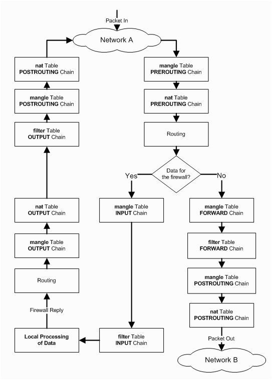

- [kernel:](#kernel)
  - [sysctl](#sysctl)
- [Text Manipulation](#text-manipulation)
  - [find:](#find)
  - [ag:](#ag)
  - [grep (egrep)](#grep-egrep)
  - [fgrep](#fgrep)
  - [awk](#awk)
  - [sed](#sed)
  - [sort](#sort)
  - [uniq](#uniq)
  - [cat](#cat)
  - [cut](#cut)
  - [wc](#wc)
  - [fmt](#fmt)
  - [echo](#echo)
- [File System](#file-system)
  - [du](#du)
  - [df](#df)
- [Network](#network)
  - [ifconfig](#ifconfig)
  - [ip](#ip)
  - [ifup, ifdown, ifquery](#ifup-ifdown-ifquery)
  - [/etc/networks/interfaces](#etcnetworksinterfaces)
  - [ping](#ping)
  - [dig](#dig)
  - [nslookup](#nslookup)
  - [route](#route)
  - [traceroute](#traceroute)
  - [iptables](#iptables)
  - [netstat](#netstat)
  - [ss](#ss)
  - [tcpdump](#tcpdump)
  - [airmon](#airmon)
  - [airodump](#airodump)
- [Process Monitoring](#process-monitoring)
  - [ps](#ps)
  - [top](#top)
  - [htop](#htop)
  - [atop](#atop)
  - [glace](#glace)
  - [lsof](#lsof)
- [Service Management](#service-management)
  - [Sysvinit](#sysvinit)
  - [Upstart](#upstart)
  - [Systemd](#systemd)
  - [Systemd Journal](#systemd-journal)
- [Packages Management](#packages-management)
  - [apt](#apt)
  - [dpkg](#dpkg)
  - [yum](#yum)
  - [rpm](#rpm)

# kernel:
## sysctl
  * Configure kernel parameters at runtime
  * -p [FILE], --load
    * Load in sysctl settings from the file specified or /etc/sysctl.conf if none given.
# Text Manipulation
## find:
  * Use Cases:
    * `$ find . -name "*.sh" -type f maxdepth 5| xargs rm -f`
  * options:
    * -type:
      * file type
    * -name:
      * True if the last component of the pathname being examined matches pattern
    * -iname: case insensitive of version of name
    * maxdepth
    * mindepth
## ag:
  * Use Cases:
    * `ag pattern`
  * options:
    * -w:
      * Only match whole words.
    * -C:
      * Print  NUM  lines of output context.
    * depth
      * -1 is unlimited
## grep (egrep)
  * Use Cases
    * case insenditive + recursive + print filename
      * `$grep -inrH ".*darwin" --include="*.yml"`
      * or
      * `$grep -inrH ".*darwin" --include "*.yml"`
    * exactly match
      * `$grep -w "deiauk" * -C 4`
  * options:
    * -r:
      * recursive
    * -i
      * case insensitive
    * -n:
      * print line number
    * -H:
      * print filename for each match
    * -v:
      * invert match
    * -w:
      * Only match whole words.
    * -C NUM:
      * Print NUM lines of output context.
    * -B NUM:
      * Print NUM lines of leading context before matching lines.
    * -A NUM:
      * Print  NUM  lines  of trailing context after matching lines.
    * --include
      * specify file pattern
## fgrep
## awk
## sed
## sort
## uniq
## cat
## cut
## wc
## fmt
## echo

# File System
## du
  * Dispaly disk usage statistics
  * Use cases:
    * $ `$ du -sh`
  * Optinons:
    * -h: human readable
    * -s: Display an entry for each specified file.
    * -x: File system mount points are not traversed.

## df
  * Display free space
  * Use cases:
    * `df -h`
    * `df -h /dev/sda`
  * options:
    * -h: (using base 2 or sizes)
      * human readable output
    * -H:  (using base 10 or sizes)
      * * human readable output

## hdparm
  * get/set SATA/IDE device parameters
  * Use cases:
    * Ｔest Read speed
      * `sudo hdparm -Tt /dev/sda`
      * output:
        * Timing cached reads:   13298 MB in  2.00 seconds = 6665.25 MB/sec
        * Timing buffered disk reads: 336 MB in  3.01 seconds = 111.54 MB/sec

## dd
  * Use case:
    * Test Write Speed
    * `dd if=/dev/zero of=/tmp/output bs=8k count=10k; rm -f /tmp/output`
  * Ref:
    * [What is the average read write speed of an SSD hard drive?](https://www.quora.com/What-is-the-average-read-write-speed-of-an-SSD-hard-drive)
    * [How to check hard disk performance](https://askubuntu.com/questions/87035/how-to-check-hard-disk-performance)


## lsblk
  * list block devices
    * `lsblk`

## fdisk
  * manipulate disk partition table

# Network
## ifconfig (Use ip command in the new linux distribution)
  * Use Cases:
    * Show all network interfaces
      * `$ifconfig `
      * or `$ifconfig a`
    * Shoe the specific network interface
      * `$ifconfig ${interface}`

## ip
  * ip from iproute2 is intended to be a replacement for the older ifconfig, route and arp net-tools programs, providing a more consistent interface.
  * It also supports various new features not supported by net-tools such as policy routing, multiple IPv4 addresses per interface (without the need for :aliases), or CIDR instead of subnet masks. (As far as I know, net-tools haven't been maintained since 2001.)
  * Form:
    * ip [options] OBJECT COMMAND
  * Use cases:
    * Show alll network interfaces
      * `$ip address` or `$ip a`
    * Show routing
      * `$ip route` or `$ip r`
    * Show network interface
      * `$ip link show`
  * Old vs New Tools
    | Old Command                                                 | New Command                                             |
    |-------------------------------------------------------------|---------------------------------------------------------|
    | ifconfig -a                                                 | ip a                                                    |
    | ifconfig enp6s0 down                                        | ip link set enp6s0 down                                 |
    | ifconfig enp6s0 up                                          | ip link set enp6s0 up                                   |
    | ifconfig enp6s0 192.168.2.24                                | ip addr add 192.168.2.24/24 dev enp6s0                  |
    | ifconfig enp6s0 netmask 255.255.255.0                       | ip addr add 192.168.1.1/24 dev enp6s0                   |
    | ifconfig enp6s0 mtu 9000                                    | ip link set enp6s0 mtu 9000                             |
    | ifconfig enp6s0:0 192.168.2.25 (IP Alias)                   | ip addr add 192.168.2.25/24 dev enp6s0                  |
    | netstat                                                     | ss                                                      |
    | netstat -tulpn                                              | ss -tulpn                                               |
    | netstat -neopa                                              | ss -neopa                                               |
    | netstat -g                                                  | ip maddr                                                |
    | netstat -g                                                  | ip a                                                    |
    | route add -net 192.168.2.0 netmask 255.255.255.0 dev enp6s0 | ip route add 192.168.2.0/24 dev enp6s0                  |
    | route add default gw 192.168.2.254                          | ip route add default via 192.168.2.254                  |
    | arp -a                                                      | ip neigh                                                |
    | arp -v                                                      | ip neigh                                                |
    | arp -s 192.168.2.33 1:2:3:4:5:6                             | ip neigh add 192.168.3.33 lladdr 1:2:3:4:5:6 dev enp6s0 |
    | arp -i enp6s0 -d 192.168.2.254                              | ip neigh del 192.168.2.254 dev wlp7s0                   |
  * Ref:
    * [what's the difference between “ip a” and “ifconfig” under SUSE 11](https://superuser.com/questions/350535/whats-the-difference-between-ip-a-and-ifconfig-under-suse-11)
    * [Linux IP command examples](https://www.cyberciti.biz/faq/linux-ip-command-examples-usage-syntax/#4)
    *

## ifup, ifdown, ifquery
  * up
    * Bring a network interface up
  * down
    * Take a network interface up
  * query
    * Parse interface configuration
  * Use Cases:
    * `ifup -i ${interface_file}`
    * `ifup -a`
    * `ifup eth0`
    * `ifquery -l`
    * `ifquery eth0`
  * Options:
    * -a: --all
      * If given to ifup
        * affect all interfaces marked auto. Interfaces are brought up in the order in which they are defined in /etc/network/interfaces.
      * If given to ifdown,
        * affect all defined interfaces. Interfaces are brought down in the order in which they are currently listed in the state file. Only  interfaces  defined  in /etc/network/interfaces will be brought down.
    * -i FILE:
      * Read interface definitions from FILE instead of from /etc/network/interfaces.

## /etc/networks/interfaces
  [Good detailed explanation of /etc/network/interfaces syntax](https://unix.stackexchange.com/questions/128439/good-detailed-explanation-of-etc-network-interfaces-syntax)

## ping
  * Use Cases:
    * `$ping -c 2${domain}`
    * `$ping -c 2${ip}`
  * Options:
    * -c: count
    * -W: timeout

## dig
  * Use Cases:
    * NS
      * find Name server of the from.ers.trendmicro.com
      * `$dig NS from.ers.trendmicro.com`
    * A (IPv4)
      * `$dig A hashsrv.ers.trendmicro.com`
    * AAAA (IPv6)
      * `$dig AAAA hashsrv.ers.trendmicro.com`
    * Reverse DNS lookup
      * `$dig -x 8.8.8.8`
    * Specify DNS server
      * `@{ip_or_hostname}`
  * Ref:
    * http://dns-learning.twnic.net.tw/bind/intro6.html

## nslookup (prefer to use dig)
  * query Internet name servers interactively
    * `$nslookup google.com.tw`

## route
  * show / manipulate the IP routing table
  * Use cases:
    * show
      * `$route -n`
      * or use `$ip a`
    * add route
      * `$route del -net 169.254.0.0 netmask 255.255.0.0 dev eth0`
    * delete route
      * `route del -net 169.254.0.0 netmask 255.255.0.0 dev eth0`
    * add default gateway
      * `route add default gw 192.168.1.250`
    * options:
      * -n:
        * Do not resolve hostanme
      * -net
        * The target is a network.
      * -host
        * The target is a host
    * flags:
      * U (route is up)
      * H (target is a host)
      * G (use gateway)
      * R (reinstate route for dynamic routing)
      * D (dynamically installed by daemon or redirect)
      * M (modified from routing daemon or redirect)
      * A (installed by addrconf)
      * C (cache entry)
      * !  (reject route)

## traceroute
  * each endpoint tests 3 times.
  * Use cases:
      * UDP
        * `$ traceroute google.com.tw`
      * TCP, wait 1 sec, do not resolve host name
        * `$ traceroute -T -n -w 1 google.com.tw`
  * Options:
    * -4:
      * ipv4
    * -6:
      * ipv6
    * -w
      * (--wait)
    * -n:
      * do not resolve IP addresses to their domain names
    * -U (--udp):
      * default
      * use UDP with port 53
    * -T (--tcp):
      * use TCP SYN to tracerouting
    * -I (--icmp)
      * use ICMP echo for tracerouting
    * -p:
      * port

## iptables
  * Tables and Chains:
    * filter
      * Packet filtering
      * Chains
        * INPUT
        * OUTPUT
        * FORWARD
    * nat
      * Network Address Translation
      * Chains
        * PREROUTING
        * PPOSTROUTING
        * OUTPUTCHAIN
    * mangle
      * TCP header modification
  * Packet flow diagram
    * 
  * Use cases:
    * Listing
      * iptables -t [table] -L [chain]
      * List all chains in the filter table
        * `iptables -t filter -L -n` or `iptables -L -n`
      * List POSTROUTING chains in the nat table
        * `iptables -t nat -L POSTROUTING -n`
      * List POSTROUTING chains in the nat table
        * `iptables -t nat -L POSTROUTING -n -v`
      * note:
        * default table is filter
        * if no chain is selected, all chains are listed
        * -v can show network interfaces
    * Dump iptables rules
      * `iptables-save`
        * The [0:0] or [1280:144299] or whatever are the count of [Packets:Bytes] that have been trough the chain .
    * Apply new iptables rules
      * `iptables-restore ${RULES}`
    * Clean iptables rules
      ```shell
      # safe clear iptables rules
      iptables -P INPUT ACCEPT
      iptables -P FORWARD ACCEPT
      iptables -P OUTPUT ACCEPT

      # delete all the rules in the chains
      iptables -t nat -F
      iptables -t mangle -F
      iptables -t filter -F

      # delete all non-builtin chains
      iptables -t nat -X
      iptables -t mangle -X
      iptables -t filter -X

      # zero the packet and bytes counter in all chains
      iptables -t nat -Z
      iptables -t mangle -Z
      iptables -t filter -Z
      ```
    * Add new chains
      * `iptables -n -t [table_name] -N [new_chain_name]`
      * `iptables -t filter -N my_white_list`
    * Add new rules:
      * Accpet all packets coming from 192.168.100.0/24
        * `iptables -A INPUT -i eth1 -s 192.168.100.0/24 -j ACCEPT`
      * Append a new rule which jumps to self-defined chain(my_whilte_list)
        * iptables -A INPUT -j my_whilte_list
    * SNAT (POSTROUTING)
      * MASQUERADE (dynamic)
        * Modify the source ip to the binded ip of eth0
          * `iptables -t nat -A POSTROUTING -s $innet -o eth0 -j MASQUERADE`
      * Fixed source ip (192.168.1.102)
        * `iptables -t nat -A POSTROUTING -o eth0 -j SNAT --to-source 192.168.1.`100
    * DNAT (PREROUTING)
      * `iptables -t nat -A PREROUTING -i eth0 -p tcp --dport 80
     -j DNAT --to-destination 192.168.100.10:80`
  * Options:
    * -n:
      * do not resolve host name
    * -P:
      * default policy
    * -F, --flush [chain]
      * Flush the selected chain (all the chains in the table if none is given).
      * This is equivalent to deleting all the rules one by one.
    * -X, --delete-chain [chain]
      * Delete the optional user-defined chain specified.
      * If  no argument is given, it will attempt to delete every non-builtin chain in the table.


  * Ref:
    * [鳥哥](http://linux.vbird.org/linux_server/0250simple_firewall.php#netfilter)
    * [linux home networking](http://www.linuxhomenetworking.com/wiki/index.php/Quick_HOWTO_:_Ch14_:_Linux_Firewalls_Using_iptables#Introduction)
    * [iptables-persistent, netfilter-persistent](https://unix.stackexchange.com/questions/125833/why-isnt-the-iptables-persistent-service-saving-my-changes)


## netstat (use ss in the new Linux distribution)
  * Use Cases
    * list listening services
      * `$ netstat -tulnp`
    * list all services
      * `$ netstat -atunp`
    * show routing table
      * `$ netstat -nr`
  * Options:
    * -a: all
    * -l: list listen services
    * -p: list pid and program
    * -t: tcp
    * -u: udp
    * -n: don't resolve hostname
    * -c: -c 5 update every 5 second
    * -n: use IP and port number
      * default is hostname and service
    * -r: --route
      * Display the routing table
## ss
  * ss is included in iproute2 package and is the substitute of the netstat. ss is used to dump socket statistics. It shows information similar to netstat. It can display more TCP and state information than other tools. It is a new, incredibly useful and faster (compared to netstat) tool for tracking TCP connections and sockets.
  * Use Cases:
    * list all services
      * `$ ss -atup`
    * list all tcp socket with port 3306 (mysql)
      * `$ ss -atnp | grep 3306`
      * `$ ss -atrp | grep 3306`  (resolve hostname)
  * Options
    * -a:
      * all
    * -l:
      * list listen services
    * -t:
      * tcp
    * -u:
      * udp
    * -n:
      * don't resolve service name
    * -r:
      * resolve hostname
    * -p:
      * show processes using socket
    * -4:
      * ipv4
    * -6:
      * ipv6

## tcpdump
  * Use cases:
    * Basic
      * Specify the monitor interface
        * `$ tcpdump -i eth0`
      * Listen from all interfaces
        * `$ tcpdump -i any`
      * Find traffic by IP (TCP)
        * `$ tcpdump tcp and src host 1.1.1.1`
      * Find traffic by Network (IP Range)
        * `$ tcpdump tcp and src net 192.168.0.0/16`
      * Get Packets Contents with Hex Output
        * `$ tcpdump -c 1 -X icmp`
      * Show traffic of One Protocol
        * `$ tcpdump icmp`
      * Find traffic Using Port ranges
        * `$ tcpdump port 80`
        * `$ tcpdump portrange 21-23`
      * Writing Captures to a File (pcap)
        * `$ tcpdump port 80 -w capture_file`
      * Reading Captures from a File
        * `$ tcpdump -r capture_file`
    * ICMP
      * Listen icmp packet from 192.168.7.1 of all interfaces
        * `$tcpdump -i any icmp and src 192.168.7.1`
    * Advanced:
      * Raw Output View
        * `$ tcpdump -ttnnvvS`
      * From specific IP and destined for a specific Port
        * `$ tcpdump -nnvvS src 10.5.2.3 and dst port 3389`
      * From One Network to Another
        * `$ tcpdump -nvX src net 192.168.0.0/16 and dst net 10.0.0.0/8 or 172.16.0.0/16`
      * Non ICMP Traffic Going to a Specific IP
        * `$ tcpdump dst 192.168.0.2 and src net and not icmp`
      * Traffic From a Host That Isn’t on a Specific Port
        * `$ tcpdump -vv src mars and not dst port 22`
    * Isolate TCP Flags
      * Isolate TCP RST flags
        * `$ tcpdump 'tcp[13] & 4!=0'`
        * `$ tcpdump 'tcp[tcpflags] == tcp-rst'`
      * Isolate TCP SYN flags
        * `$ tcpdump 'tcp[13] & 2!=0'`
        * `$ tcpdump 'tcp[tcpflags] == tcp-syn'`
      * Isolate packets that have both the SYN and ACK flags set.
        * `$ tcpdump 'tcp[13]=18'`
      * Isolocate TCP URG Flags
        * `$ tcpdump 'tcp[13] & 32!=0'`
        * `$ tcpdump 'tcp[tcpflags] == tcp-urg'`
      * Isolocate TCP ACK Flags
        * `$ tcpdump 'tcp[13] & 16!=0'`
        * `$ tcpdump 'tcp[tcpflags] == tcp-ack'`
      * Isolocate TCP PSH Flags
        * `$ tcpdump 'tcp[13] & 8!=0'`
        * `$ tcpdump 'tcp[tcpflags] == tcp-psh'`
      * Isolocate TCP FIN Flags
        * `$ tcpdump 'tcp[13] & 1!=0'`
        * `$ tcpdump 'tcp[tcpflags] == tcp-fin'`
    * HTTP
      * User Agent
        * `$ tcpdump -vvAls0 | grep 'User-Agent:'`
      * GET Requests
        * `$ tcpdump -vvAls0 | grep 'GET'`
      * Host Headers
        * `$ tcpdump -vvAls0 | grep 'Host:'`
      * Cookike
        * `$ tcpdump -vvAls0 | grep 'Set-Cookie|Host:|Cookie:'`
    * DNS
      * `$ tcpdump -vvAs0 port 53`
    * FTP
      * `$ tcpdump -vvAs0 port ftp or ftp-data`
    * NTP
      * `$ tcpdump -vvAs0 port 123`
    * Find Cleartext Passwords
      * `$ tcpdump port http or port ftp or port smtp or port imap or port pop3 or port telnet -lA | egrep -i -B5 'pass=|pwd=|log=|login=|user=|username=|pw=|passw=|passwd= |password=|pass:|user:|username:|password:|login:|pass |user '`

  * options:
    * -A:
      * Print each packet (minus its link level header) in ASCII.  Handy for capturing web pages.
    * -l:
      * Make stdout line buffered.  Useful if you want to see the data while capturing
    * -i:
      * interface
      * If unspecified, tcpdump searches the system interface list for the lowest numbered, configured up interface (excluding loopback), which may turn out to be, for example, ``eth0''.
      * 'any'
        * can be used to capture  packets  from  all  interfaces.
        * Note that captures on the ``any'' device will not be done in promiscuous mode.
    * -n:
      * Don't convert addresses (i.e., host addresses, port numbers, etc.) to names.
    * -q:
      * quick output
    * -X:
      * In addition to printing the headers of each packet, **print the data of each packet** (minus its link level  header)  in  hex
      and ASCII.
    * -XX:
      * Same as -X, but also shows the ethernet header.
    * -w file:
      * Write  the raw packets to file rather than parsing and printing them out.
      * They can later be printed with the -r option.
    * -tttt:
      * Give maximally human-readable timestamp output.
    * -r file:
      * Read packets from file
    * -c:
      * count, exit after receiving count packets
    * protocol :
      * tcp, udp, ip, arp, rarp, fddi, icmp
    * src ${condition}
    * dst ${condition}
    * host
      * hostname
    * net
      * IP range
    * port ${port_number}:
      * specify port number
    * portrange
      * portrange 21-23
    * logical operator:
      * not(!), and(&&), or(||)
    * Example:
      * https://danielmiessler.com/study/tcpdump/#protocol
      * https://colobu.com/2019/07/16/a-tcpdump-tutorial-with-examples/#%E6%A0%B9%E6%8D%AE%E7%BD%91%E6%AE%B5%E8%BF%9B%E8%A1%8C%E6%9F%A5%E6%89%BE

## airmon
## airodump

# Process Monitoring
## ps
  * Use Cases:
  * `$ps aux|grep ${pattern}`
## top
## htop
## atop
## glace
## lsof
  * list open files

# Service Management
## Sysvinit
  * config:
    * Path
      * `/etc/init.d`
  * Use Cases:
    * start the service
    * `$ service ${service_name} start`
    * stop the service
      * `$ service ${service_name} stop`
    * reload the service
      * `$ service ${service_name} reload `
    * restart the service
      * `$ service ${service_name} restart`
      * `$ service ${service_name} condrestart`
        * restart the service if it is running.
  * Ref:
    * https://www.ibm.com/developerworks/cn/linux/1407_liuming_init1/index.html?ca=drs-
## Upstart
  * config:
    * path
      * `/etc/init`
    * example:
        `sh
        start on started network-services
        stop on stopping network-services
        respawn
        script
            PROGRAM="/usr/local/bin/uwsgi"
            OPTIONS="--ini /etc/uwsgi.d/uwsgi_postman.ini"
            exec $PROGRAM $OPTIONS
        end script
        `
  * Use Cases:
    * list
      * `$ initctl list`
    * start the service
      * `$ initctl start ${service_name}`
      * `$ start ${service_name}`
    * stop the service (SIGTEM)
      * `$ initctl stop ${service_name}`
      * `$ stop ${service_name}`
    * reload (SIGHUP)
      * `$ initctl reload ${service_name}`
      * `$ reload ${service_name}`
    * reload
      * `$ initctl reload ${service_name}`
      * `$ reload ${service_name}`
  * Ref:
    * http://upstart.ubuntu.com/cookbook/
    * https://www.ibm.com/developerworks/cn/linux/1407_liuming_init2/index.html?ca=drs-
## Systemd
  * **Systemd is Compatible with Sysvinit**.
  * config
   * path
     * /usr/lib/systemd
  * Type:
    * service, socket, target
  * Use Cases:
   * List installed unit files
     * `$ systemctl list-unit-files`
   * List socket units currently in memory.
     * `$ systemctl list-sockets`
   * List jobs
     * `$ systemctl list-jobs`
   * List units currently in memory
     * `$ systemctl list-units`
   * List services currently in memory
     * `$ systemctl list-units --type=service --state=active`
     * `$ systemctl list-units --type=service --state=running`
     * `$ systemctl list-units --type=service --state=active,failed`
   * Check the config
     * `$ systemctl cat ${service_name}.service`
   * Start the service
     * `$ systemctl start ${service_name}.service`
   * Stop the service
     * `$ systemctl stop ${service_name}.service`
   * Reload the service
     * `$ systemctl reload ${service_name}.service`
   * Restart the service
     * `$ systemctl restart ${service_name}.service`
     * `$ systemctl condrestart  ${service_name}.service`
       * restart the service if it is running.
   * Enable the service when start up
     * `$ systemctl enable ${service_name}.service`
   * Disable the service when start up
     * `$ systemctl disable ${service_name}.service`
  * Ref:
    * https://www.ibm.com/developerworks/cn/linux/1407_liuming_init3/index.html?ca=drs-
    * https://blog.gtwang.org/linux/linux-basic-systemctl-systemd-service-unit-tutorial-examples/
    * http://linux.vbird.org/linux_basic/0560daemons.php#systemctl_cmd
## Systemd Journal
  * Use Cases:
    * Show the newest entries first
      * `$ journalctl -r -n 20 prometheus.service`
        * -r : reverse, show the latest
        * -n : lines
    * List all values that a specified field takes
      * `$ journalctl -F=field`
    * Show log of the specific unit
      * `$ journalctl -f -u prometheus.service`
        * -f: follow mode
        * -u: unit
    * Output to pretty json format
      * `journalctl -u cron.service -n 1 --no-pager -o json-pretty`
    * Show entries with the specified priority
      * `journalctl -p 3`
      * `journalctl -p err`
      * -p --priority=RANGE
      * 0: emerg
      * 1: alert
      * 2: crit
      * 3: err
      * 4: warning
      * 5: notice
      * 6: info
      * 7: debug

  * Ref:
    * https://linuxtoy.org/archives/systemd-journal.html


# Packages Management

## apt
* use cases:
  * see also APT-GET(8) and sources.list(5)
  * configs:
    * `/etc/apt`
    * sources.list(5):
      * `/etc/apt/sources.list`
  * install
    * `$apt install ${packge-name}`
    * `$apt install -f`
  * update
    * update is used to resynchronize the package index files from their sources.
    * `$apt update`
  * upgrade
    * upgrade is used to install available upgrades of all packages currently installed on the system from the sources configured via sources.list(5).
    * New packages will be installed if required to satisfy dependencies, but existing packages will never be removed. If an upgrade for a package requires the remove of an installed package the upgrade for this package isn't performed.
  * remove
    * remove is identical to install except that packages are removed instead of installed.
    * Note that removing a package leaves its configuration files
      on the system.
    * `$ apt remove {package-name}`
  * purge
    * purge is identical to remove except that packages are removed and purged (any configuration files are deleted too).
    * `$ apt purge {package-name}`
  * options:
    * -f, --fix-broken
      * Fix; attempt to correct a system with broken dependencies in place.


## dpkg
 * use cases:
   * install packages
     * `$dpkg -i ${packge-file}`
   * remove packages
     * `$dpkg -r ${packge-name}`
   * List packages
     * `$dpkg -l`
     * `$dpkg -l ${pattern}`
   * List files installed to your system from packge-name
      * `$dpkg -L ${package-name}`
   * configure packages
     * configure all unconfigure packages
       * `$dpkg --configure -a`
     * configure a specific package
       * `$dpkg --configure ${packge-name}`

## yum

## rpm
