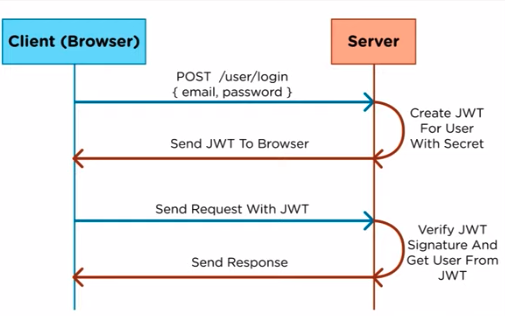
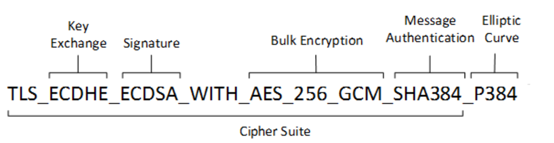
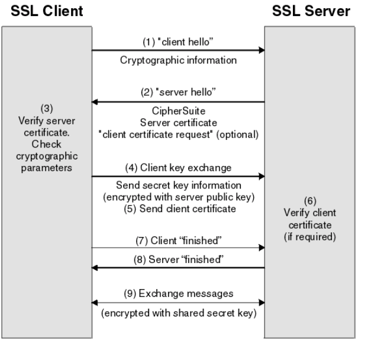
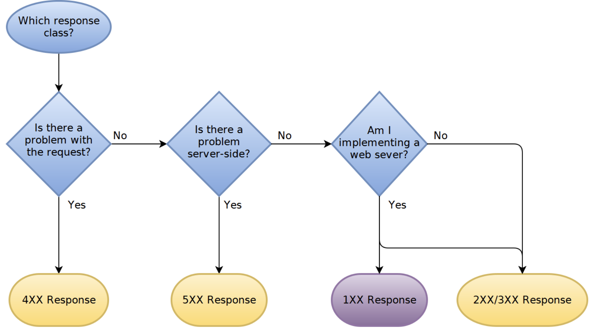

WebServices
- [FAQ](#faq)
- [Auth](#auth)
- [TLS](#tls)
- [RESTful](#restful)
- [HTTP Methods](#http-methods)
- [HTTP Status Code](#http-status-code)
- [GRPC](#grpc)
- [Proto3](#proto3)
- [Profiling](#profiling)

## FAQ
  * Authentication vs Authorization:
    * Authentication:
      *  is the process of ascertaining that somebody really is who they claim to be.
    * Authorization:
      *  refers to rules that determine who is allowed to do what. E.g. Adam may be authorized to create and delete databases, while Usama is only authorised to read.
  * Forward vs Redirect:
    * Forward
      * **Redirect sets the response status to 302, and the new url in a Location header, and sends the response to the browser.** Then the browser, according to the http specification, **makes another request** to the new url
    * Redirect
      * **Forward happens entirely on the server. The servlet container just forwards the same request to the target url, without the browser knowing about that.**
  * [HTTP/2](https://http2.github.io/faq/)
    - Key differents to HTTP/1.x
      - is binary, instead of textual
      - is **fully multiplexed**, instead of ordered and blocking **can therefore use one connection for parallelism**
      - **Header Compression**
      - Allows servers to “push” responses proactively into client caches

## Auth
 * JWT
   * Ref:
     * https://www.youtube.com/watch?v=7Q17ubqLfaM
   * About JWT
     * JWT is for authorization.
     * JWT defines the token format not the protocol.
     * JWT is kepts on client side, and can be used to authorize many services as long as they share the smae secret key.
   * Flow:
     * 
   * JWT Token format:
     * https://jwt.io/
     * header
     * payload
       * https://tools.ietf.org/html/draft-ietf-oauth-json-web-token-32#section-4.1.1
       * iss (issuer)
       * sub (subject)
       * aud (audience)
       * iat (issued at)
       * exp (expiration time)
       * ...
     * **signature**
       * Used to verify
       * Generated by header + payload + secret key
       * The secret key should be saved on server side.

 * OAuth2.0
   * [What are the main differences between JWT and OAuth authentication?](https://stackoverflow.com/questions/39909419/what-are-the-main-differences-between-jwt-and-oauth-authentication)
     * JWT is just a token format, OAuth 2.0 is a protocol.
     * OAuth 2.0 and "JWT authentication" have similar appearance when it comes to the (2nd) stage where the Client presents the token to the Resource Server: the token is passed in a header.
     * But "JWT authentication" is not a standard and does not specify how the Client obtains the token in the first place (the 1st stage). That is where the perceived complexity of OAuth comes from: it also defines various ways in which the Client can obtain an access token from something that is called an Authorization Server.

## TLS
  * Ref
    * [Symmetric/Asymmetric/Hybrid Encryption](http://david50.pixnet.net/blog/post/28796015)
    * [TLS handshake](https://www.ibm.com/support/knowledgecenter/en/SSFKSJ_7.1.0/com.ibm.mq.doc/sy10660_.htm)

  * [Cipher Suite](https://docs.microsoft.com/zh-tw/windows/win32/secauthn/cipher-suites-in-schannel?redirectedfrom=MSDN)
    *
      * TLS_ECDHE_ECDSA_WITH_AES_256_CBC_SHA384
        * TLS:
          * Indicate the protocol
        * ECDHE:
          * Signifies the **key exchang**e algorithm
        * ECDSA:
          * Signifies the **authentication** algorithm
        * AES_256_CBC:
          * Indicates the **bulk encryption** algorithm
        * SHA384:
          * Indicates the MAC algorithm (for **integrity**)

  * TLS handshake overview
    * 
    * step1:
      * The SSL or TLS client sends a client **hello message** that lists **cryptographic information** such as the SSL or **TLS version** and, in the client's order of preference, **the CipherSuites supported by the client**.
        * The message also contains a random byte string that is used in subsequent computations. The protocol allows for the client hello to include the data compression methods supported by the client.
    * step2:
      * The SSL or TLS server responds with a server hello message that contains the **CipherSuite chosen by the server** from the list provided by the client, the session ID, and another random byte string. **The server also sends its digital certificate.**
  			* If the server requires a digital certificate for client authentication, the server sends a client certificate request that includes a list of the types of certificates supported and the Distinguished Names of acceptable Certification Authorities (CAs).
		* step3:
  		* The SSL or TLS client verifies the server's digital certificate.
		* step4:
  		* The SSL or TLS client sends the **random byte string  that enables both the client and the server to compute the secret key** to be used for encrypting subsequent message data.
    		* **The random byte string itself is encrypted with the server's public key**.
		* step5:
			* If the SSL or TLS server sent a client certificate request, the client sends a random byte string encrypted with the client's private key, together with the client's digital certificate, or a no digital certificate alert. This alert is only a warning, but with some implementations the handshake fails if client authentication is mandatory.
  	* step6:
			* The SSL or TLS server verifies the client's certificate.
    * step7:
      * The SSL or TLS client sends the server a finished message, which is encrypted with the secret key, indicating that the client part of the handshake is complete.
    * step8:
      * The SSL or TLS server sends the client a finished message, which is encrypted with the secret key, indicating that the server part of the handshake is complete.
    * step9:
      * For the duration of the SSL or TLS session, the server and client can now **exchange messages that are symmetrically encrypted with the shared secret key**.

## RESTful
  * Ref:
    * [TritonHo](https://github.com/TritonHo/slides/blob/master/Taipei%202016-04%20talk/RESTful%20API%20Design-tw-2.1.pdf)
    * [10 Best Practices for Better RESTful API](https://blog.mwaysolutions.com/2014/06/05/10-best-practices-for-better-restful-api/)
    * [Best Practices for Designing a Pragmatic RESTful API](https://www.vinaysahni.com/best-practices-for-a-pragmatic-restful-api)
  * Key Conecpt:
    * The key principles of REST involve **separating your API into logical resources**. These resources are **manipulated using HTTP requests where the method** (GET, POST, PUT, PATCH, DELETE) has specific meaning.
  * Practices:
    * Use nouns or gerunds but no verbs
      * gerunds(動名詞): MoneyTransfer
    * GET method and query parameters should not alter the state 
    * Use plural nouns
      * Do not mix up singular and plural nouns. Keep it simple and use only plural nouns for all resources.
      * /cars instead of /car
    * Use sub-resources for relations
      * GET /cars/711/drivers/4
    * Provide filtering, sorting, field selection and paging for collections 
      * Filtering
        * GET /cars?**color=red**
          * Returns a list of red cars
        * GET /cars?**seats<=2**
          * Returns a list of cars with a maximum of 2 seats
      * Sorting
        * GET /cars?**sort=-manufactorer,+model**
          * This returns a list of cars sorted by descending manufacturers and ascending models.
      * Field Selection
        * GET /cars?**fields=manufacturer,model,id,color**
      * Paging
        * GET /cars?**offset=10&limit=5**
        * Use **limit** and **offset**. It is flexible for the user and common in leading databases. The default should be limit=20 and offset=0
        * To send the total entries back to the user use the custom HTTP header: **X-Total-Count.**
    * Version your API
    * Handle Errors with HTTP status codes
    * Allow overriding HTTP method
  * Example:
    * | Resource  | GET                   | POST                     | PUT                    | DELETE                |
      |-----------|-----------------------|--------------------------|------------------------|-----------------------|
      | /car      | Return a list of cars | Create a new car         | Bulk Update            | Delete all cars       |
      | /cars/711 | Return a specific car | Method not allowed (405) | Updates a specific car | Delete a specific car |

## HTTP Methods
  * Methods
    * GET (safe & idempotent):
      * read
    * HEAD (safe & idempotent):
      * read (header only)
    * POST:
      * create
    * PATCH:
      * update
    * DELETE:
      * delete the resource
  * Property:
    * Safe
      * Safe methods are HTTP methods that do not modify resources.
    * idempotent
      * An idempotent HTTP method is a HTTP method that can be called many times without different outcomes. It would not matter if the method is called only once, or ten times over. The result should be the same.

## HTTP Status Code
  * Ref:
    * https://httpstatuses.com/
    * https://stackoverflow.com/questions/942951/rest-api-error-return-good-practices
  * Flow:
    * 
  * 2xx: Success
    * 200 ok:
      * The general code.
    * 201 Created:
      * Resource created successfully.
    * 202 Accepted:
      * Request accepted and still being processed.
      * This request may take a lot of time.
      * Async job
    * 204 No Content:
      * Request completed successfully but nothing to return.
      * delete, put may use this return code.
  * 3xx: Redirection
      * 301 Moved Permanently:
      * 303 See Other
        * Response can be found elsewhere (e.g. after the client has sent a POST request)
  * 4xx: Client Error (Client should not retry)
    * 400 Bad Request:
      * The general code (client side)
    * 401 Unauthorized:
      * Client not authenticated*
    * 403 Forbidden:
      * Client not allowed for the request
    * 404 Not Found:
      * Resource not found
    * 405 Method Not Allowed:
      * The HTTP verb not supported for this API endpoint
    * 406 Not Acceptable:
      * The **requested Content-Type** not supported (Accept header)
    * 415 Unsupported Media Type:
      * The Content-Type of the **request body** not supported (Content-Type header)
    * 409 Conflict:
      * This Resouce has been modified by other
  * 5xx: Serverl Error (Client may reasonably retry)
    * 500 Internal Server Error
    * 502 Bad Gateway:
      * Load balancing tier issue
      * bad response from the upstream server (usually only a gateway or proxy server would return 502)
    * 503 Service Unavailable:
      * Service temporarily unavailable (i.e. may be available shortly)
    * 504 Gateway Timeout:
      * Upstream server timeout (usually only a gateway or proxy server would return 504)

## GRPC
  * Ref:
    * [grpc](https://grpc.io/)
  * Why gRPC
    * gRPC is a modern RPC protocol implemented on top of HTTP/2. HTTP/2 is a Layer 7 (Application layer) protocol, that runs on top of a TCP (Layer 4 - Transport layer) protocol, which runs on top of IP (Layer 3 - Network layer) protocol. gRPC has many advantages over traditional HTTP/REST/JSON mechanism such as
      * Binary protocol (HTTP/2)
      * Multiplexing many requests on one connection (HTTP/2)
      * Header compression (HTTP/2)
      * Strongly typed service and message definition (Protobuf)
      * Idiomatic client/server library implementations in many languages
  * Suggest using gRPC for the following cases
    * When the microservices is only internal and when one server needs to talk to the other.
    * When your internal services requires **duplex streaming** with high load of data.

## Proto3
  * Ref:
    * [proto3](https://developers.google.com/protocol-buffers/docs/proto3)
  * Advantages:
    * Platform/language neutral
    * Backward compatibility
    * Performance (compared with JSON)
    * Do not need accessor class for mapping
    * Do not need Doc (.proto is the doc)

  * Backward Compatibility:
    * [Rule of Updating A Message Type](https://developers.google.com/protocol-buffers/docs/proto3#updating)

## Profiling
  * wrk